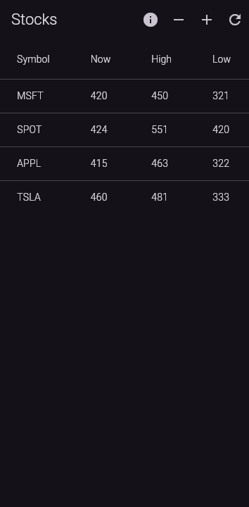
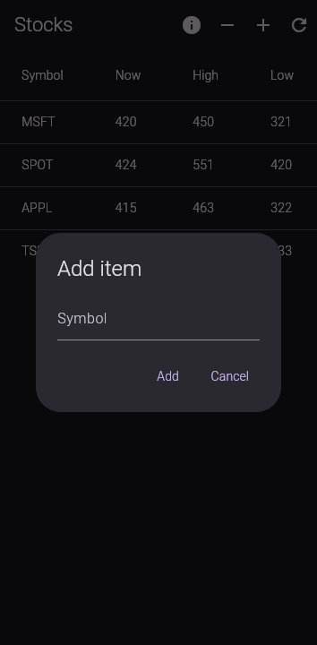

# Stocks
A simple stock tracker made with Flutter and Dart.

## Screenshots

    
    

## Features
- Add items to track
- Remove items
- Update based on request

## To-do
- [X] Basic UI
- [X] Basic functionality (update items, add items, remove items)
- [X] Fetch basic data from web
- [X] Dark mode
- [ ] Calculate change
- [ ] Graphs
